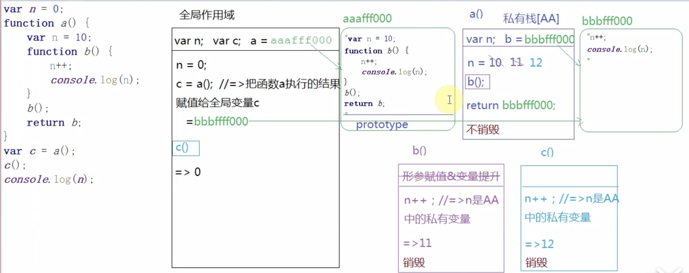

# 面试题1

## 1. 第一题

```js
var n = 0
function a() {
  var n = 10
  function b() {
    n++
    console.log(n)
  }
  b()
  return b
}
var c = a()
c()
console.log(n)

// 11 12 0
```

画图解析：



## 2. 第二题

```js
var a = 4
function abc(x, y, a) {
  a = 10
  arguments[2] = 100
}

arguments 与形参的映射机制是建立在函数执行后形参赋值的一瞬间。